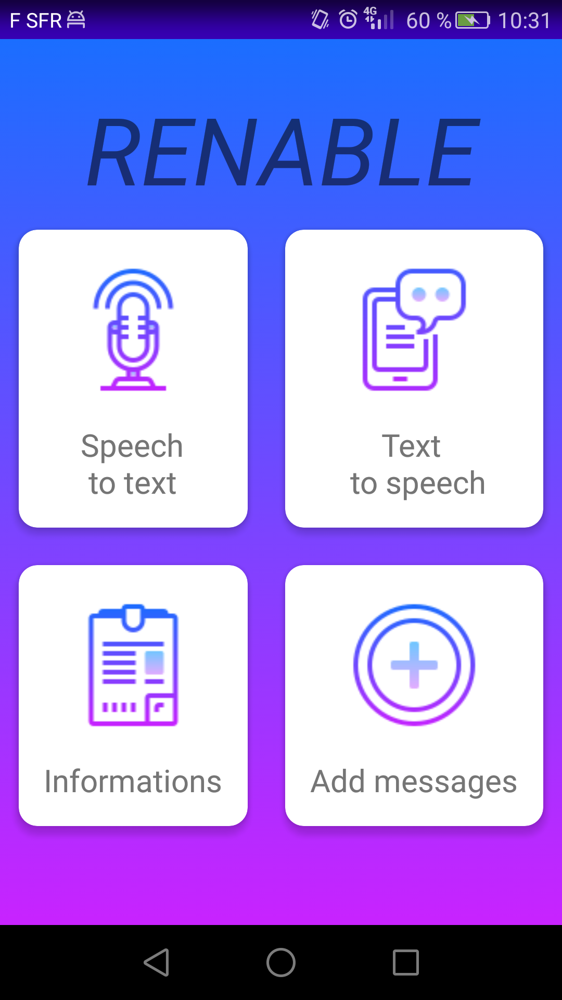

# Android Renable

Android Renable is an android application made for deaf and mute people to help them to communicate easily in there daily life.

# App manuel

The main menu is made of 4 buttons:

## Speech to text

This activity is made of a textView, a spinner to choose a language and a hold button.

To use it you will have to hold the button and speak with your microphone and release the button for your phrase to display.

## Text to speech

The opposite of the previous one made as well of a EditView, a spinner and a classic button.

You will have to type your phrase in the EditView and just to click the button for your phone to say it.

## Add messages

You will have in some case some phrases that you will say oftenly so in this activity you will be able to add and keep them without typing it everytime.

Just type your phrase in the EditView and add the messages.
If you click on an added messages it will load it in the Text to speech activity for you to use it.
you can of course delete messages bye clicking the toggle button and click on the message that you want to delete. 

## Informations

This last activity is made in case you have an accident, if your phone is picked by someone and turn on the screen (of course if you did enable the option) it will display crucial informations to help you in your situation.

